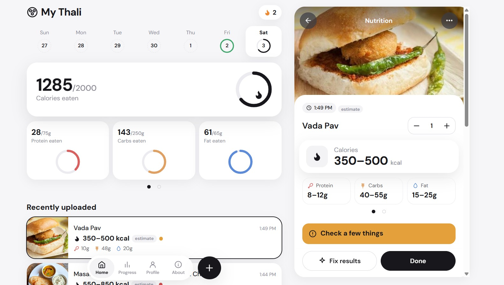
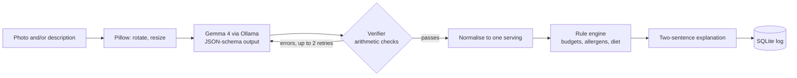

# 🍱 MyThali

### Privacy-first AI food analysis powered by local Gemma 4.

Scan a nutrition label or photograph a meal, and see how it fits your
nutrition goals, allergens, and dietary preferences.

**[ Live Demo Link](https://deeper-kelkoo-capital-orlando.trycloudflare.com)** 



*MyThali home dashboard showing today's nutrition, food log, and AI meal analysis.*

---

## Why MyThali?

"A common approach is to ask an LLM to both interpret a food image and decide whether the food fits a user's profile

MyThali separates **AI perception from deterministic decision-making**:

> **Gemma sees → Python verifies → Python decides**

Gemma 4 handles visual understanding. A deterministic Python pipeline
checks the extracted numbers, normalizes them, detects allergens, and
evaluates the food against the user's profile.

**The model never decides whether a food fits the user's profile.**
---

## Why a local, open-weight model

- **The data is health data.** Allergies, medical diets, religious food rules and photos of what you eat. MyThali runs Gemma 4 through [Ollama](https://ollama.com) on the laptop, makes no outside requests, and keeps only a small thumbnail of each logged photo.
- **A small model needs a harness.** `gemma4:e4b` fits on a laptop, and small models misread digits. A JSON schema fixes the shape of the answer but not the numbers in it. The harness in `app/harness.py` checks the numbers with arithmetic and sends the model its own mistakes to correct. The [results](#results) section measures what that changes.
- **The model is replaceable.** Set `THALI_MODEL` to any vision model Ollama can run. Nothing in the pipeline depends on a hosted service or an API key.

## checklist

Entered in Hacktoberfest Hack Day Surat: MLH **Best Use of Gemma 4** and **Best Open-Source AI Project**. Team AlgoHolics.

| Requirement | Where to verify |
|---|---|
| Open-weight AI is central | Every scan is read by Gemma 4 through Ollama: `app/ollama_client.py`, `app/extract.py`. Meal mode sends a photo, a text description, or both. |
| Original implementation | `app/harness.py` (verify-and-retry loop), `app/verify.py` (arithmetic checks), `app/rules.py` (rule engine), `app/knowledge.py` (allergen and diet tables with Hindi and Gujarati terms). |
| Evidence that it works | [Results](#results), produced by `eval/run_eval.py`, and the tests in `tests/`. |
| Public repo, open licence | MIT. See [LICENSE](LICENSE). |
| Reproducible | Three commands to run, `pytest` needs no Ollama. See [Run it yourself](#run-it-yourself). |
| The model does not decide the verdict | Budgets, allergens and diets are plain Python in `app/rules.py`. |

## What it does

- **Profile.** Daily targets for calories, protein, carbs, fat, sugar and sodium, meals per day, a diet (none, vegetarian, eggetarian, vegan, Jain, halal) and a free-text allergen list.
- **Label scan.** Upload a photo or take one with the camera. Labels in Hindi and Gujarati are read, and the ingredients are translated to English.
- **Meal mode.** A photo, a text description of the dish, or both. The result is a range, labelled as an estimate.
- **Verdict.** A result for each rule (calories, carbs, fat, sugar, sodium, protein, allergens, diet), an overall green, amber or red, and a two-sentence explanation that names the rule behind it.
- **Servings and corrections.** Change the servings or fix any number and the verdict recomputes at once, with no model call.
- **Food log.** Daily totals against the goal, a week strip, a streak and a progress view.
- **Verification panel.** Each scan shows how many attempts it took, what the verifier caught and what the model corrected.

## Try it

### Run it yourself

1. Install [Ollama](https://ollama.com) v0.20 or newer.
2. `ollama pull gemma4:e4b`
3. `pip install -r requirements.txt`
4. `uvicorn app.main:app`
5. Open http://127.0.0.1:8000

The default model is `gemma4:e4b`, which Ollama runs on your machine. To use another model, set `THALI_MODEL`:

```powershell
# PowerShell
$env:THALI_MODEL = "gemma4:e4b"
uvicorn app.main:app
```

```sh
# bash
THALI_MODEL=gemma4:e4b uvicorn app.main:app
```

A model tag ending in `cloud` runs on Ollama's servers, so photos sent to it leave the machine. Use a local tag to keep everything on the laptop.

### A three-minute tour

1. Open **Profile**. Choose a diet, add an allergen such as `peanut`, and save.
2. Press **New scan**, choose **Nutrition label**, and upload a photo of a packet. Open **How this was checked** on the result to see the attempts and what the verifier tested.
3. Scan a label whose ingredients contain your allergen. The verdict turns red and names the matched ingredient.
4. Choose **Meal**, add a photo, and type a description such as `two rotis with ghee and dal`. The result is a range, and the allergen row stays at a warning because hidden ingredients cannot be seen.
5. Change the servings or press **Fix results**. The verdict updates without calling the model.

## How a scan works



1. **Read.** Pillow fixes rotation and resizes the photo. Gemma 4 fills a fixed JSON schema with what is printed on the label, or with ranges for a meal. Decoding is constrained to the schema through Ollama's `format` field.
2. **Verify and retry.** `app/harness.py` checks the answer with `app/verify.py`. On failure it sends the model its own answer plus the exact errors, up to two more times.
3. **Normalise.** `app/extract.py` converts kJ, salt and per-100 g values to one serving. Every nutrient is a `{lo, hi}` range.
4. **Decide.** `app/rules.py` applies budgets, allergens and diet in pure Python, using the tables in `app/knowledge.py`.
5. **Explain and store.** The model rephrases the rule results in two sentences, with a template as the fallback. SQLite holds the profile and the log.

### Example: the verifier catching a misread

This example is illustrative. It shows the kind of check the pipeline runs.

| Step | What happens |
|---|---|
| Model reads the label | calories 250, protein 5 g, carbs 30 g, fat 2 g |
| Verifier computes | 4 × 5 + 4 × 30 + 9 × 2 = 158 kcal. The gap of 92 kcal is larger than the allowed 50 kcal (the larger of 25 kcal or 20%). |
| Harness replies to the model | Its own answer, plus a message stating the calories, the macros and the 158 kcal they imply, and a request to read the label again. |
| Model reads again | calories 160, same macros |
| Verifier | The numbers agree. The reading passes and moves on to normalisation. |

If no attempt passes, the API returns `needs_retake` and asks for a better photo. It does not guess.

## Decisions and trade-offs

- **The model reads, code decides.** Allergen and diet matching, budgets and unit conversion are plain Python, so they are testable and give the same answer every time.
- **Ranges, not single numbers, for meals.** A photo cannot show portion size or cooking oil. The app stores `{lo, hi}` for every nutrient and runs every rule on the range.
- **A meal photo can never pass an allergen check.** A match fails, and no match is a warning, because hidden ingredients cannot be seen.
- **Protein never fails a food.** Falling short of a per-meal protein target is a warning. A snack should not turn red for having little protein.
- **Failure is reported, not hidden.** When no attempt passes the verifier, the app asks for a retake. It does not return the least bad guess as if it were a reading.
- **Editing never calls the model.** Changing servings or a number re-runs the rule engine and uses the template explanation, so corrections are instant.
- **The explanation is checked.** The model sees only the rule results. Its text is rejected if it is too long or contains the word "safe", and the template is used instead.

## Results

The same model, `gemma4:e4b`, reads every label photo twice: once with a plain prompt, and once through the MyThali pipeline (JSON schema, verifier, retry loop).

The benchmark measures:

- JSON validity
- Field accuracy
- Average retry attempts
- Allergen misses

Run `python eval/run_eval.py` to reproduce the evaluation locally.

Field accuracy counts a number as correct within 5% or 1 unit. An allergen miss is an allergen present on the label that the system did not flag. How to reproduce: [Reproduce the evaluation](#reproduce-the-evaluation).

## Technical reference

### The harness

`harness.run(messages, schema, verify, max_retries)` is a general loop with nothing about food in it:

1. Call the model with the schema in Ollama's `format` field.
2. Parse the reply, tolerating code fences and stray prose around the JSON object.
3. Pass it to the verifier, which returns a list of error messages. An empty list is a pass.
4. On errors, append the model's answer and a correction message listing each error, then call again.

It returns `data`, `ok`, `attempts`, `issues` and the per-attempt `history`. When no attempt passes, `data` is the attempt with the fewest errors and `ok` is false. The harness never repairs a value itself. Errors from Ollama (unreachable, model missing) are not retried.

### What the verifiers check

A schema guarantees the shape of the answer, not that the numbers are possible. Every message states the numbers involved, because it is sent back to the model.

**Labels** (`verify_label`)

- At least one nutrient was read, and no value is negative.
- Protein + carbohydrate + fat is at most 100 g for a per-100 g column, or at most the serving size (with 5% slack) for a per-serving column.
- Sugar is at most carbohydrate.
- Calories are at most 905 kcal per 100 g and at most 3000 kcal in any case.
- Calories agree with 4 × protein + 4 × carbohydrate + 9 × fat, within the larger of 25 kcal or 20%.
- Sodium is at most 10 000 mg, which catches a grams or salt mix-up.

**Meals** (`verify_meal`)

- The items list is not empty.
- Calories, protein, carbohydrate and fat each have a minimum and a maximum, neither negative, in the right order.
- The calorie midpoint is at most 3500 kcal and agrees with the macro midpoints within the larger of 60 kcal or 25%.

### Normalisation

Unit conversion is done in code, never by the model: kJ to kcal at 4.184, salt to sodium at 400 mg per gram, and per-100 g values scaled by the printed serving size (or treated as a 100 g serving when none is printed). Sugar, fibre and sodium are left unknown for meals. Each conversion adds a note that is shown with the result.

### The rule engine

`rules.evaluate(item, servings, profile, consumed)` returns the scaled totals, a list of rules with a `pass`, `warn` or `fail` status and a sentence of detail, and an overall `green`, `amber` or `red` taken from the worst rule.

- **Budgets.** Each daily target is divided by `meals_per_day`. Carbs, fat, sugar and sodium fail when the low end of the range is over the per-meal limit, and warn when the high end is over it or within 80% of it. Calories are also checked against what is left of the day's goal. Protein is a minimum, and falling short does not change the colour. An empty target switches its rule off.
- **Allergens.** Eleven built-in groups (peanut, tree nut, milk, egg, soy, wheat or gluten, fish, shellfish, sesame, mustard, sulphite) with English, Hindi and Gujarati terms, transliterations such as `maida` and `ghee`, and additive codes such as `E220` and `INS 220`. Aliases map what a user types (`dairy`, `seafood`, `coeliac`) to groups, and an unknown word is searched for literally. A match in the ingredients or a "Contains" statement fails. A "May contain" match warns.
- **Diets.** Vegetarian, eggetarian, vegan, Jain and halal, each a set of term groups searched in the same way.
- **Matching.** Text is lower-cased and NFKC-normalised. ASCII terms match whole words with an optional plural. Hindi and Gujarati terms match as substrings. Each group lists exclusion phrases that are removed first, so `cocoa butter` does not trip the milk check and `nutmeg` does not trip the nut check.

### The explanation

The model is given only the rule results, never the label or the photo, and asked for two sentences that name the rule behind an amber or red result. The text is rejected if it is too long or contains the word "safe", and a template built from the same rule results is used instead. The template is also used whenever the user edits a value.

## Tech stack

| Layer | Technology |
|---|---|
| Language | Python 3.11 |
| API server | FastAPI on Uvicorn |
| Validation | Pydantic v2 models for every request body and the normalised item |
| Model runtime | [Ollama](https://ollama.com) over its HTTP API (`/api/chat`, `/api/tags`), called with `httpx` |
| Model | Gemma 4 vision (`gemma4:e4b`), temperature 0, schema-constrained JSON output |
| Image handling | Pillow: EXIF rotation, resize, JPEG re-encode, thumbnails |
| Storage | SQLite through SQLAlchemy 2.0 |
| Front end | Plain HTML, CSS and JavaScript ES modules. No framework, no build step, no CDN |
| Tests | pytest with FastAPI's `TestClient` |

The app makes no outside requests. The font is bundled, and FastAPI's interactive docs (`/docs`, `/redoc`) are switched off because they load scripts from a CDN.

### Configuration

Every setting is an environment variable, read once at start-up in `app/config.py`. A value that is not a number, or is below its minimum, stops the app with a message naming the variable.

| Variable | Default | Meaning |
|---|---|---|
| `OLLAMA_HOST` | `http://127.0.0.1:11434` | Where Ollama listens. `host:port` with no scheme and `0.0.0.0` are both accepted and fixed up. |
| `THALI_MODEL` | `gemma4:e4b` | Vision model tag. |
| `THALI_TIMEOUT` | `180` | Seconds allowed for one model call. |
| `THALI_HEALTH_TIMEOUT` | `3` | Seconds allowed for the status check. |
| `THALI_MAX_RETRIES` | `2` | Correction attempts after the first answer. |
| `THALI_DB` | `data/mythali.db` | SQLite file. A relative path is taken from the project root. |
| `THALI_MAX_UPLOAD_MB` | `15` | Largest accepted photo. |

Fixed by the pipeline: photos are resized to 1600 px on the longest side at JPEG quality 88, thumbnails to 480 px, and a meal description is capped at 600 characters.

### API

All routes are JSON under `/api`. Errors come back as `{"detail": "..."}` with a message written for the user.

| Method | Path | Purpose |
|---|---|---|
| `GET` | `/api/health` | App version, and whether Ollama is reachable and the model installed. |
| `GET` | `/api/profile` | The profile, with `configured: false` until one is saved. |
| `PUT` | `/api/profile` | Save goals, diet, allergens and daily targets. |
| `POST` | `/api/scan/label` | Multipart `image`. Reads a nutrition label. |
| `POST` | `/api/scan/meal` | Multipart `image`, a `description`, or both. Estimates a meal. |
| `POST` | `/api/evaluate` | Recompute the verdict after an edit. No model call. |
| `GET` | `/api/log?day=YYYY-MM-DD` | A day's entries, totals and targets. Defaults to today. |
| `POST` | `/api/log` | Add an entry, to today or to a given `day`. |
| `PUT` | `/api/log/{id}` | Change an entry's item or servings. |
| `DELETE` | `/api/log/{id}` | Remove an entry. |
| `GET` | `/api/week?day=YYYY-MM-DD` | Sunday to Saturday totals, per-day status and the logging streak. |

A scan returns `item`, `evaluation`, `explanation`, a `thumbnail` data URL and a `harness` report (`ok`, `attempts`, `issues`). Nothing is stored until the item is posted to `/api/log`. When the model's answer never passes the verifier, the scan returns `needs_retake: true` with a message and no item.

Status codes beyond 200 and 201: `400` unreadable image or bad `day`, `404` missing log entry, `413` oversized upload, `422` body fails validation, `503` Ollama unreachable or model not installed, `504` model timed out, `502` any other Ollama failure.

### Data and privacy

One SQLite file, `data/mythali.db` by default, created on the first request and ignored by git.

| Table | Contents |
|---|---|
| `profile` | A single row holding the profile as a JSON document. |
| `log` | One row per logged food: `day`, `logged_at`, `kind` (label or meal), `name`, `servings`, midpoint `calories`, `protein_g`, `carbs_g` and `fat_g` as plain columns for daily totals, `overall`, a `thumbnail` data URL, and a JSON `payload` with the full item, evaluation and explanation. |

The original photo is not kept. Only the 480 px thumbnail is stored with the log entry. The app has no telemetry and no accounts.

## Tests

```
pytest
```

The tests do not need Ollama. The harness takes its model call as an argument, so the tests pass in canned replies. The API tests run on an in-memory SQLite database with the Ollama status check patched out.

| File | Covers |
|---|---|
| `tests/test_verify.py` | Each arithmetic check on label readings and meal estimates. |
| `tests/test_harness.py` | The retry loop, best-attempt selection and JSON parsing. |
| `tests/test_rules.py` | Budgets, allergen and diet matching, exclusions, overall verdict. |
| `tests/test_api.py` | Every route, uploads, the log, the week view and the static app. |

## Reproduce the evaluation

1. Put label photos in `eval/images/`.
2. Add one row per photo to `eval/labels.csv` with the printed values as ground truth.
3. Run `python eval/run_eval.py`. It writes the table to `eval/results.md`.

Options: `--limit N` for the first N rows, and `--labels`, `--images` and `--out` to change the paths. The script uses the model named by `THALI_MODEL`.

## Limitations

- Meal photos give ranges, not measurements. Portion size and cooking oil cause the largest errors, and every meal result is labelled as an estimate.
- Allergen checks read the printed ingredient list. A label with no visible ingredients gives a "not checked" warning, and a meal photo can never pass an allergen check.
- A blurry or curved label can still be misread. The verifier catches readings that cannot be true. It cannot catch a wrong number that is still plausible, so the app lets you correct any value with **Fix results**.
- Halal and Jain results flag common ingredients only. Certification and community rules cannot be checked from a label.
- Scan time depends on the laptop, and a machine without a GPU is slower.
- One user per database. There are no accounts.

## Project layout

```
app/
  config.py         settings from environment variables
  ollama_client.py  the only module that talks to Ollama
  schemas.py        JSON schemas for the model, Pydantic models for the API
  harness.py        verify-and-retry loop; knows nothing about food
  verify.py         arithmetic checks on a label reading or a meal estimate
  extract.py        image preparation, prompts, normalisation to one serving
  knowledge.py      allergen and diet term tables, and the text matcher
  rules.py          the rule engine: item + profile -> verdict
  explain.py        two-sentence summary, model-written or templated
  db.py             SQLite tables and queries
  main.py           FastAPI routes and the static file mount
static/
  index.html        the page shell and the scan dialog
  app.js            navigation; Home, Progress, Profile and About views
  scan.js           scan sheet: upload, drag and drop, or camera
  detail.js         one food: verdict, rules, edit and log controls
  ui.js             DOM helpers, icons, rings, the fetch wrapper
  style.css
eval/
  run_eval.py       raw prompt against the full pipeline
  labels.csv        ground truth, one row per photo
tests/
```

## Team

**AlgoHolics**: Anushka,Jatin,Rudra,Samih. Built at Hacktoberfest Hack Day Surat.

## Disclaimer

MyThali flags allergen risk from the printed ingredients. It does not certify food as safe. Estimates from meal photos cannot see hidden ingredients. This is not medical advice.

## Licence

MIT. See [LICENSE](LICENSE). The bundled DM Sans font is under the SIL Open Font License; see `static/fonts/OFL.txt`.
